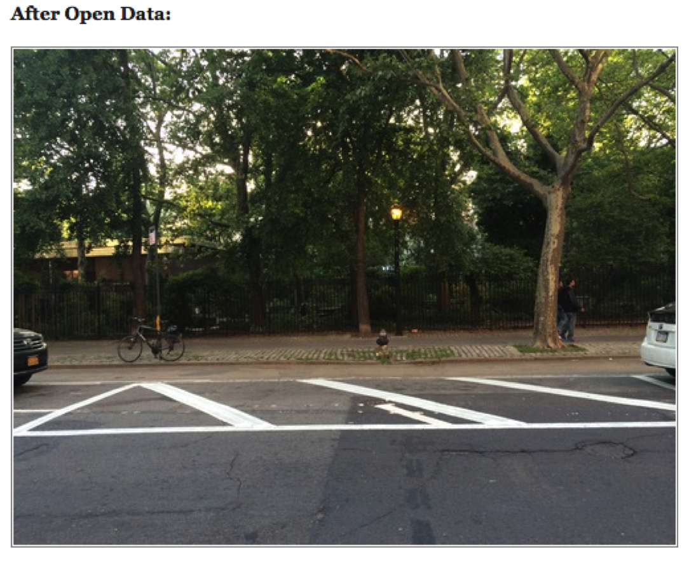

```{r setup, include=FALSE}
options(htmltools.dir.version = FALSE)
```

class: center, middle

# Data is...

---

class: center, middle

# Some examples...


[form Flowing Data](https://flowingdata.com/2016/04/14/every-kobe-bryant-shot-charted/)

---

class: center, middle

# Some examples...


[form Fivethirtyeight](https://fivethirtyeight.com/features/the-20-most-extreme-cases-of-the-book-was-better-than-the-movie/)


---

class: center, middle

# Some examples...


[form Dear Data](http://www.dear-data.com/)


---

class: center, middle


.large[Data are .green[factual information] (such as measurements or statistics) used as a basis for reasoning, discussion, or calculation.]

---
### Telling a story...

[Florence Nightingale](http://bigbangdata.somersethouse.org.uk/florence-nightingale-a-data-pioneer/)


---
### Telling a story...

[I Quant NY](http://iquantny.tumblr.com/post/83770853308/update-single-fire-hydrant-nets-nyc-33000-a)

.left-column[]


.right-column[]

---

[I Quant NY](http://iquantny.tumblr.com/post/83770853308/update-single-fire-hydrant-nets-nyc-33000-a)

.left-column[]


.right-column[]


---
### Telling a story...

[Amanda Cox: You Draw It: How Family Income
Predicts Children’s College Chances](https://www.nytimes.com/interactive/2015/05/28/upshot/you-draw-it-how-family-income-affects-childrens-college-chances.html)


---
### So how to get started?

Topic -> Conceptualisation -> Operationalisation

---
### Topic

What do you want to be able to say? What questions will you answer? 

---
### Conceptualisation

What *variables* will you need to collect?

---
### Operationalisation

How will you measure this? 
What is included/ excluded?

---
### Exercise

Conceptualise hate crime - what is in definition?
Then operationalise your concept - how will you measure?


---
class: center, middle


.large[Let's have a go: explore police.uk crime data]

[Get the data](data.police.uk)


---

class: center, middle

.large[Get to know your data: Data Dictionary]

[Where the data provider tells you about their data](https://data.police.uk/about/#columns)

---
class: center, middle

.large[Think about the limitations of the data]

[Example of caution: location anonymisation](https://data.police.uk/about/#location-anonymisation)


---
class: center, middle

.large[Any other possible limitations of the data?]

---
class: center, middle

.large[Getting to know your data]


---
class: center, middle

.large[Summarising categorical data - frequency table]


---
class: center, middle

.large[Summarising categorical data - 2-way frequency table]


---
class: center, middle

.large[Summarising numeric data - mean and median]


---
class: center, middle

.large[Summarising numeric data - is one number enough?]


[FiveThirtyEight](https://fivethirtyeight.com/features/al-gores-new-movie-exposes-the-big-flaw-in-online-movie-ratings/)
---
???

